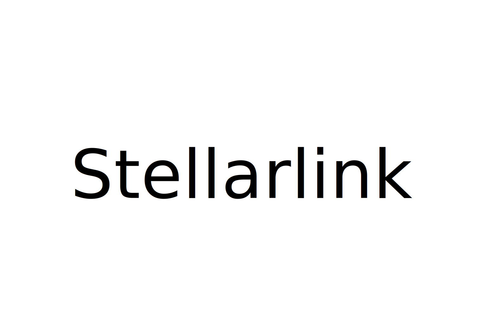

<p>
  <a href="http://stellarlink.co/">
    
  </a>
</p>

# Stellarlink Skills

[](https://skills.sh/stellarlinkco/skills)

Agent skills for work that needs more control than a single prompt: long-running execution, high-recall code review, and measurable self-improvement loops.

These are not vibe-coding macros. They are small operating protocols for agents: explicit state, hard gates, deterministic rollback, and proofs before claims. Use them directly, fork them, or steal the patterns.

## Quickstart

Install the collection with the skills.sh installer:

```bash
npx skills@latest add stellarlinkco/skills
```

Then call the skill you need from your agent:
```text
/harness implement prd.md; loop verify, fix, retest
```

For manual installs, copy the skill directory you need from [`skills/`](./skills/) into your agent's skills directory. `harness` also needs hook registration; see [`skills/harness/README.md`](./skills/harness/README.md).

## Why These Skills Exist

AI agents fail in boring, repeatable ways. They stop too early. They review too narrowly. They make a prompt or skill better once, then lose the path that made it better. This repo turns those failure modes into protocols.

### #1: The Agent Stops Before the Work Is Done

**The problem:** long tasks die at session boundaries. Context windows reset, partial state disappears, and the agent starts summarizing instead of finishing.

**The fix:** [`harness`](./skills/harness/SKILL.md) gives the agent a durable task ledger, append-only progress log, hook-driven stop blocking, dependency checks, leases, and recovery rules. Progress files become the context.

Use it when a task has many subtasks, must survive sleep/resume cycles, or needs automatic recovery after a failed attempt.

### #2: The Review Misses the Bug That Matters

**The problem:** most agent reviews optimize for precision too early. They produce a tidy list, but miss the dangerous bug hiding in a changed contract, deleted branch, or wrapper boundary.

**The fix:** [`code-review`](./skills/code-review/SKILL.md) uses a max-recall pipeline: gather the real diff, generate candidates from independent angles, verify them, run a final gap sweep, then return a capped JSON findings list.

Use it for PRs, branch diffs, local working-tree diffs, security-sensitive changes, or any review where a missed P1 costs more than an extra candidate.

### #3: Improvement Without an Oracle Turns Into Drift

**The problem:** “make this better” is not a loop. Without a measurable oracle, each mutation is just taste with confidence.

**The fix:** [`self-evolution`](./skills/self-evolution/SKILL.md) turns prompts, skills, documents, configs, code, and experiments into evaluate-gate loops. It supports GT case suites and scalar scoreboard metrics, keeps a ledger, and reverts mutations that do not pass.

Use it when the artifact can be measured and you want repeated improvement without guessing.

## Reference

### Execution

- **[harness](./skills/harness/SKILL.md)** — Long-running agent framework for multi-session task execution, progress persistence, stop blocking, dependency handling, rollback, and recovery.
- **[harness install guide](./skills/harness/README.md)** — Hook setup, state files, activation marker, concurrent mode, and failure-recovery behavior.

### Review

- **[code-review](./skills/code-review/SKILL.md)** — High-recall code review protocol for PRs, branch diffs, and working-tree diffs. Focuses on correctness, security, contracts, concurrency, performance, reuse, simplification, altitude, and convention failures introduced by the change.

### Evolution

- **[self-evolution](./skills/self-evolution/SKILL.md)** — Autonomous mutation-evaluate-gate loop for measurable artifacts. Supports GT Suite Mode, Scoreboard Mode, Hybrid Mode, layered mutations, trace-driven diagnosis, and deterministic keep/discard decisions.
- **[self-evolution references](./skills/self-evolution/references/)** — Ground-truth format, artifact guide, evaluation layers, mutation strategy, and gate rules.
- **[self-evolution scripts](./skills/self-evolution/scripts/)** — Assertion evaluation, structural checks, and results tracking helpers.

## Design Notes

- One skill directory is one product surface.
- `SKILL.md` is the agent-facing protocol.
- Extra docs belong beside the skill only when setup or operation needs more detail.
- Scripts are support tools, not hidden behavior. The skill must explain when and why to run them.
- Verification is part of the product. A skill that cannot tell the agent how to prove success is unfinished.
